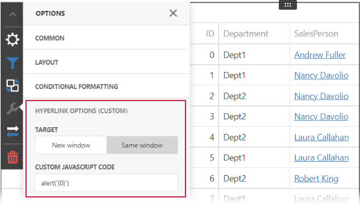

<!-- default badges list -->

<!-- default badges end -->
# BI Dashboard for Web Forms - How to Implement Additional Options for the Grid's Hyperlink Column

This example shows how to use [Custom Properties](https://docs.devexpress.com/Dashboard/401702/web-dashboard/ui-elements-and-customization/create-custom-properties) to adjust the [Hyperlink Column](https://docs.devexpress.com/Dashboard/119499/web-dashboard/create-dashboards-on-the-web/dashboard-item-settings/grid/columns/hyperlink-column)'s capabilities for the [Grid](https://docs.devexpress.com/Dashboard/117161/web-dashboard/create-dashboards-on-the-web/dashboard-item-settings/grid) item. The following options are implemented:

* **Target** - Specifies whether the link is opened in a new window or tab.
* **Custom JavaScript Code** - Specifies JavaScript code which is executed when a user clicks the hyperlink. The `{0}` placeholder returns the value of the field specified in the hyperlink's URI.

In addition, the [Calculated Field](https://docs.devexpress.com/Dashboard/117196/web-dashboard/create-dashboards-on-the-web/providing-data/calculated-fields) is used in the hyperlink column configuration to pass multiple URL arguments.

The resulting options look as follows:

<!-- default file list -->
## Files to Review

* [Default.aspx](./CS/Default.aspx)
* [Default.aspx.cs](./CS/Default.aspx.cs)
* [GridHyperlinkOptionsExtension.js](./CS/GridHyperlinkOptionsExtension.js)

<!-- default file list end -->

## Documentation

- [Hyperlink Column](https://docs.devexpress.com/Dashboard/119499/web-dashboard/create-dashboards-on-the-web/dashboard-item-settings/grid/columns/hyperlink-column) 
- [Access to Underlying Widgets in ASP.NET Web Forms](https://docs.devexpress.com/Dashboard/117573/web-dashboard/aspnet-web-forms-dashboard-control/access-to-underlying-widgets)
- [Custom Properties](https://docs.devexpress.com/Dashboard/401702/web-dashboard/ui-elements-and-customization/custom-properties)

## More Examples

- [Dashboard - Constant Lines](https://github.com/DevExpress-Examples/dashboard-constant-lines)
- [Dashboard for Web Forms - How to use Custom Properties to Modify Ranges in the Gauge Dashboard Item](https://github.com/DevExpress-Examples/web-forms-dashboard-gauge-ranges)
- [Dashboard for Web Forms - How to access API of underlying widgets](https://github.com/DevExpress-Examples/how-to-access-api-of-underlying-widgets-in-the-aspnet-dashboard-control-t492396)
<!-- feedback -->
## Does this example address your development requirements/objectives?

 

(you will be redirected to DevExpress.com to submit your response)
<!-- feedback end -->
